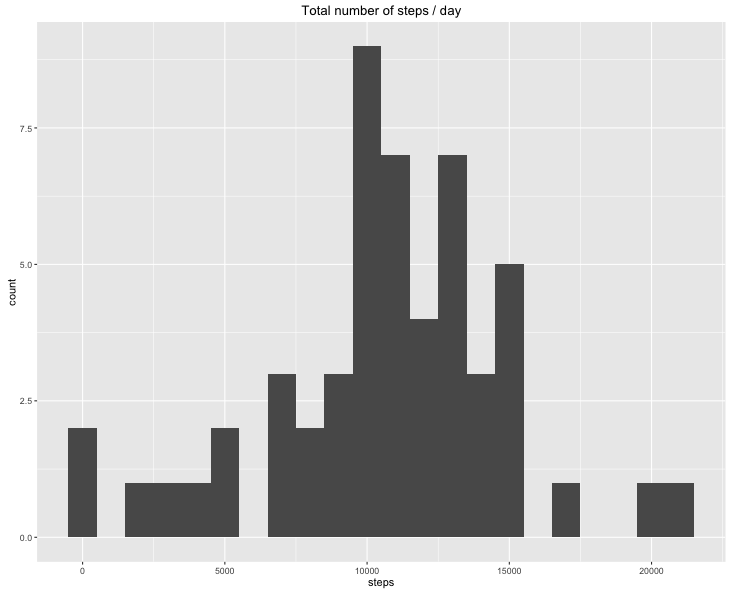
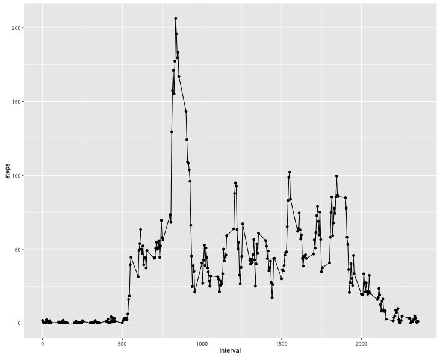
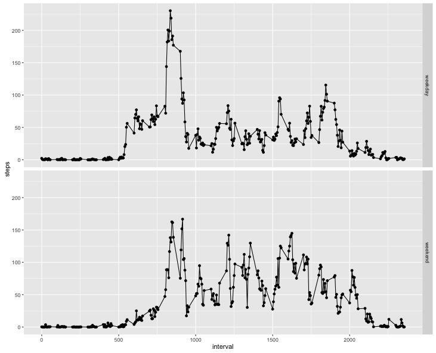

#### load libraries
```
library(data.table)
library(ggplot2)
library(knitr)
```

## Loading and preprocessing the data
```
setwd("~/RepData_PeerAssessment1")
```
set US time
```
Sys.setlocale("LC_TIME","en_US.UTF-8")
```
unzip & load data
```
unzip("activity.zip")
my_data <- data.table(read.csv("activity.csv", header=TRUE, na.strings="NA"))

```

## What is mean total number of steps taken per day?
#### Make a histogram of the total number of steps taken each day
```
total_steps_by_date <-aggregate (steps ~ date,my_data,'sum',na.rm=TRUE)
qplot(steps, data = total_steps_by_date,binwidth=1000) +
    ggtitle('Total number of steps / day')
```



#### Calculate and report the mean and median total number of steps taken per day
```
mean_total <- mean(total_steps_by_date$steps,na.rm=TRUE)
median_total <- median(total_steps_by_date$steps,na.rm=TRUE)
print(mean_total)
  [1] 10766.19
print(median_total)
  [1] 10765
```


The mean of total number of steps taken per day are 10766.19 and median are 10765.

## What is the average daily activity pattern?
#### Make a time series plot (i.e. type = "l") of the 5-minute interval (x-axis) and the average number of steps taken, averaged across all days (y-axis)
```
average_steps_by_interval <- aggregate (steps ~ interval, my_data,'mean',na.rm=TRUE)
qplot(interval,steps, data=average_steps_by_interval )+geom_line()
+labs(title="average number of steps taken, averaged across all days")
```



#### Which 5-minute interval, on average across all the days in the dataset, contains the maximum number of steps?
```
average_steps_by_interval [ which.max(average_steps_by_interval $steps) ,]
```

```
    interval    steps
104      835 206.1698
```
## Imputing missing values
#### Calculate and report the total number of missing values in the dataset (i.e. the total number of rows with NAs)
```
sum(is.na(my_data))
            [1] 2304
```
#### Devise a strategy for filling in all of the missing values in the dataset.
I choose stragtegy to fill NA values with mean steps by interval


#### Create a new dataset that is equal to the original dataset but with the missing data filled in.
```
clone_data <- my_data
clone_data$steps <- as.double(clone_data$steps)
for (i in 1:nrow(clone_data)) {
    if (is.na(clone_data[i,]$steps)) {
        clone_data[i,]$steps <- average_steps_by_interval[average_steps_by_interval$interval==clone_data[i,]$interval,]$steps
    }
}
```

#### Make a histogram of the total number of steps taken each day 
```
clone_total_steps_by_date <-aggregate (steps ~ date,my_data,'sum',na.rm=TRUE)
qplot(steps, data = clone_total_steps_by_date,binwidth=1000) +
    ggtitle('Total number of steps / day')
```


#### Calculate and report the mean and median total number of steps taken per day
```
mean_clone_total <- mean(clone_total_steps_by_date$steps,na.rm=TRUE)
median_clone_total <- median(clone_total_steps_by_date$steps,na.rm=TRUE)
print(mean_clone_total)
  [1] 10766.19
print(median_clone_total)
  [1] 10766.19
```

The mean of total number of steps taken per day are 10766.19 and median are 10765

#### Do these values differ from the estimates from the first part of the assignment?
```
differ_data<-data.frame(Calculation=c('Without NA', 'Extrapolated'), Mean=c(mean_total, mean_clone_total), Median=c(median_total, median_clone_total))
kable(head(differ_data), format = "markdown")
```

|Calculation  |     Mean|    Median|
|:------------|--------:|---------:|
|Without NA   | 10766.19|     10765|
|Extrapolated | 10766.19|  10766.19|

## Are there differences in activity patterns between weekdays and weekends?

```
weekend <- c('saturday','sunday')
clone_data$wday<-tolower(weekdays(strptime(clone_data$date, '%Y-%m-%d')))
clone_data$factorday <- factor((clone_data$wday %in% weekend), labels=c('weekday','weekend'))
clone_steps_by_interval <- aggregate(steps ~ interval + factorday, clone_data, 'mean')
qplot(interval,steps,data=clone_steps_by_interval,facets=factorday~.)+geom_line()
```

