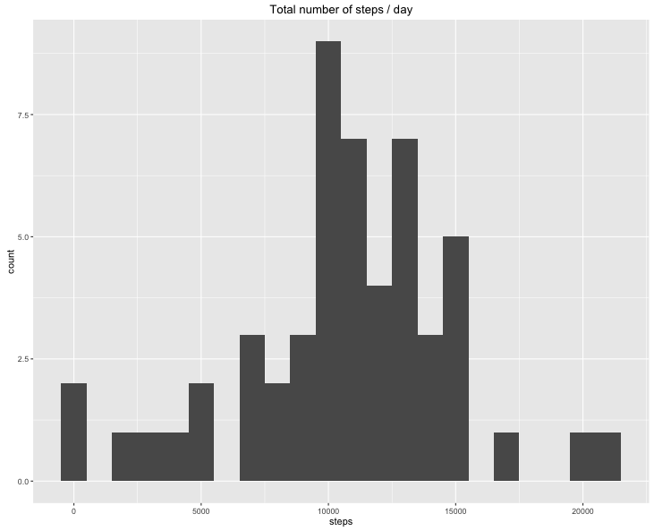

# Reproducible Research: Peer Assessment 1

#### load libraries
```
library(data.table)
library(ggplot2)
library(knitr)
```

## Loading and preprocessing the data
```
setwd("~/RepData_PeerAssessment1")
```
set US time
```
Sys.setlocale("LC_TIME","en_US.UTF-8")
```
unzip & load data
```
unzip("activity.zip")
my_data <- data.table(read.csv("activity.csv", header=TRUE, na.strings="NA"))

```

## What is mean total number of steps taken per day?
#### Make a histogram of the total number of steps taken each day
```
total_steps_by_date <-aggregate (steps ~ date,my_data,'sum',na.rm=TRUE)
qplot(steps, data = total_steps_by_date,binwidth=1000) +
    ggtitle('Total number of steps / day')
```


#### Calculate and report the mean and median total number of steps taken per day
```
mean_total <- mean(total_steps_by_date$steps,na.rm=TRUE)
median_total <- median(total_steps_by_date$steps,na.rm=TRUE)
print(mean_total)
  [1] 10766.19
print(median_total)
  [1] 10765
```


The mean of total number of steps taken per day are 10766.19 and median are 10765.

## What is the average daily activity pattern?
#### Make a time series plot (i.e. type = "l") of the 5-minute interval (x-axis) and the average number of steps taken, averaged across all days (y-axis)
```
average_steps_by_interval <- aggregate (steps ~ interval, my_data,'mean',na.rm=TRUE)
qplot(interval,steps, data=average_steps_by_interval )+geom_line()
+labs(title="average number of steps taken, averaged across all days")
```


#### Which 5-minute interval, on average across all the days in the dataset, contains the maximum number of steps?
```
average_steps_by_interval [ which.max(average_steps_by_interval $steps) ,]
```

```
    interval    steps
104      835 206.1698
```
## Imputing missing values
#### Calculate and report the total number of missing values in the dataset (i.e. the total number of rows with NAs)
```
sum(is.na(my_data))
            [1] 2304
```
#### Devise a strategy for filling in all of the missing values in the dataset.
I choose stragtegy to fill NA values with mean steps by interval


#### Create a new dataset that is equal to the original dataset but with the missing data filled in.
```
clone_data <- my_data
clone_data$steps <- as.double(clone_data$steps)
for (i in 1:nrow(clone_data)) {
    if (is.na(clone_data[i,]$steps)) {
        clone_data[i,]$steps <- average_steps_by_interval[average_steps_by_interval$interval==clone_data[i,]$interval,]$steps
    }
}
```

#### Make a histogram of the total number of steps taken each day 
```
clone_total_steps_by_date <-aggregate (steps ~ date,my_data,'sum',na.rm=TRUE)
qplot(steps, data = clone_total_steps_by_date,binwidth=1000) +
    ggtitle('Total number of steps / day')
```



#### Calculate and report the mean and median total number of steps taken per day
```
mean_clone_total <- mean(clone_total_steps_by_date$steps,na.rm=TRUE)
median_clone_total <- median(clone_total_steps_by_date$steps,na.rm=TRUE)
print(mean_clone_total)
  [1] 10766.19
print(median_clone_total)
  [1] 10766.19
```

The mean of total number of steps taken per day are 10766.19 and median are 10765

#### Do these values differ from the estimates from the first part of the assignment?
Yes, median values are differ, but not mean values, because of we fill NA values with mean data
```
differ_data<-data.frame(Calculation=c('Without NA', 'Extrapolated'), Mean=c(mean_total, mean_clone_total), Median=c(median_total, median_clone_total))
kable(head(differ_data), format = "markdown")
```

|Calculation  |     Mean|    Median|
|:------------|--------:|---------:|
|Without NA   | 10766.19|  10765.00|
|Extrapolated | 10766.19|  10766.19|

## Are there differences in activity patterns between weekdays and weekends?

Create new columns wday and factorday to extract weekend days from others:
```
weekend <- c('saturday','sunday')
clone_data$wday<-tolower(weekdays(strptime(clone_data$date, '%Y-%m-%d')))
clone_data$factorday <- factor((clone_data$wday %in% weekend), labels=c('weekday','weekend'))
clone_steps_by_interval <- aggregate(steps ~ interval + factorday, clone_data, 'mean')
qplot(interval,steps,data=clone_steps_by_interval,facets=factorday~.)+geom_line()
```


